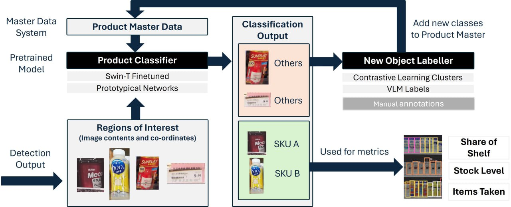

# ThoughtfulAI

## Project Overview
ThoughtfulAI is aimed at automating machine learning operations in the retail sector, enhancing customer experiences, and operational efficiencies through advanced ML techniques such as few-shot learning, contrastive learning, and vision-language modeling. The project includes a series of Jupyter notebooks that demonstrate the development and evaluation of these methods using the RP2K dataset for retail product recognition.

)

## Installation
To set up this project locally, clone the repository and install the required dependencies:

```bash
git clone https://github.com/brinashong/ThoughtfulAI.git
cd ThoughtfulAI
pip install -r requirements.txt
```

## RP2K Dataset
You can find the dataset at the RP2K project page https://www.pinlandata.com/rp2k_dataset/
Alternatively, the dataset can be downloaded directly from the link provided by the RP2K authors https://blob-nips2020-rp2k-dataset.obs.cn-east-3.myhuaweicloud.com/rp2k_dataset.zip

## Usage
The project is structured into different components, each contained in a separate Jupyter notebook, to be used for enhancing the current ML pipeline as automated help to keep the classifier updated even when there are new products coming in:


**Classification_Model_Benchmarking/*.ipynb**: Preprocessing of data and running of finetuning for the architecture which is to be tested  

**SimCLR.ipynb**: Implementation of contrastive learning to handle and cluster new unknown products.

**QwenVL.ipynb**: Utilization of a vision-language model for zero-shot learning in product identification.

**ProtoNet.ipynb**: Application of few-shot learning for quick adaptation to new products.

## Note on Computational Resources
This project involves computationally intensive models. It is recommended to use a system with a capable GPU to expedite training and inference.
